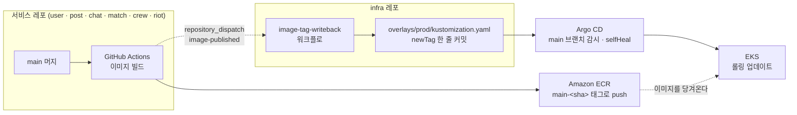

# infra

GameHouse의 **실행 환경**을 담는 레포. 서비스 코드는 여기 없고, 그 코드를 어디에 어떻게 띄울지만 있다.

---

## 1. 좌표

GameHouse는 7개 레포로 나뉘어 있다. 이 레포는 그중 **서비스가 아닌 유일한 레포**다.

| 레포 | 맡은 일 |
|---|---|
| `gamehouse-user` | 계정 · 프로필 · 알림 |
| `gamehouse-post` | 파티 모집글 · 신청 |
| `gamehouse-chat` | 파티 채팅 |
| `gamehouse-match` | Team Fit 매칭 · AI 설명 |
| `gamehouse-crew` | 함께한 기록 · 하우스 추천 |
| `gamehouse-riot` | Riot API 연동 |
| `gamehouse-common` | 6개 서비스가 공유하는 이벤트 계약 |
| **`infra`** | **매니페스트 · GitOps · 관측 · 부하 테스트** |

서비스 레포는 "이 서비스가 무엇을 하는가"를 설명한다.
이 레포는 "그 서비스들이 **어디서 어떻게 도는가**"만 설명한다.
`Deployment`, `Service`, `Ingress`, `HPA`, `NetworkPolicy`, `ExternalSecret` 은 전부 여기 있다.

**환경은 3개다.**

| 환경 | 클러스터 | 트래픽 | DB | 시크릿 |
|---|---|---|---|---|
| `local` | kind | ingress-nginx | in-cluster PostgreSQL | 평문 Secret |
| `dev` | EKS | ALB | RDS | External Secrets |
| `prod` | EKS (`gamehouse-main`) | ALB | RDS | External Secrets |

frontend `Deployment` 는 **local 에만 있다.** dev/prod 의 프런트는 S3 + CloudFront 라 클러스터 밖이다.

---

## 2. 배포 흐름도

코드를 고치는 곳과 배포를 일으키는 곳이 다르다. 서비스 레포는 **이미지까지만** 만들고, 클러스터에 반영하는 것은 Argo CD다.



**읽는 법**

1. 서비스 레포의 CI가 이미지를 ECR에 올린다. 태그는 `main-<커밋 SHA 40자리>`.
2. 같은 CI가 infra 레포로 `repository_dispatch` 를 쏜다. 페이로드는 `{ service, sha, env }`.
3. `image-tag-writeback` 워크플로가 해당 서비스의 **`newTag` 한 줄만** 고쳐서 커밋한다.
   커밋 전에 `kustomize build` 로 렌더가 깨지지 않는지 확인하고, 다른 파일이 바뀌었으면 중단한다.
4. Argo CD가 `main` 브랜치의 `k8s/overlays/prod` 를 보고 있다가 그 커밋을 가져간다.
5. `selfHeal: true` — 누가 클러스터를 손으로 바꿔도 Git 상태로 되돌린다.

**배포 승인 지점은 `develop → main` PR 이다.**
Argo CD 수동 sync를 따로 두지 않았다. 브랜치 분리가 이미 승인 역할을 하기 때문이다.
`env` 가 `dev` 면 `develop` 브랜치의 `overlays/dev`, `main` 이면 `main` 브랜치의 `overlays/prod` 로 간다.

**Argo CD 구조는 app-of-apps 다.**

```
사람 ──kubectl apply(최초 1회)──> gamehouse-prod-root
                                    ├─> gamehouse-prod              ──> overlays/prod
                                    └─> gamehouse-observability-main ──> overlays/observability-main
```

사람이 `kubectl apply` 하는 파일은 `k8s/argocd/root/prod.yaml` **하나뿐**이다.
이후 Application 을 추가할 때는 `k8s/argocd/applications/prod/` 에 파일을 넣고 그 `kustomization.yaml` 에 등록하면 된다.

`prune: false` 다. Git에서 파일을 지워도 클러스터 리소스는 남는다(고아). 삭제는 수동이다.

**GitOps 밖에 있는 것들**

`kube-prometheus-stack`, `Loki`, `Alloy`, `Argo CD 자신` 은 Helm 으로 직접 설치·업그레이드한다.
values 는 `k8s/platform/values/*.main.yaml` 에 있고, 고쳤으면 `helm upgrade` 를 직접 쳐야 반영된다.

---

## 3. 디렉터리 지도

루트 README는 **어디에 무엇이 있는지**까지만 말한다. 실행 방법과 절차는 하위 README가 갖고 있다.

| 경로 | 무엇이 있나 |
|---|---|
| `eks/main-cluster.yaml` | eksctl 클러스터 정의. 노드 타입 · 개수 · 서브넷 배치 |
| `k8s/base/` | 7개 워크로드(6서비스 + rabbitmq)의 환경 무관 매니페스트 |
| `k8s/components/aws/` | dev·prod 공통 AWS 조각 — ExternalSecret, gp3 StorageClass, PDB, ALB Ingress, 평문 Secret 삭제 패치 |
| `k8s/components/observability/` | ServiceMonitor · PrometheusRule · AlertmanagerConfig · 공통 대시보드 |
| `k8s/overlays/local` `dev` `prod` `observability-main` | 환경별 차이. replicas · HPA · ConfigMap · NetworkPolicy · **이미지 태그** |
| `k8s/argocd/` | Root App 1개 + 환경별 Application |
| `k8s/platform/values/` | Helm 차트 values (Prometheus · Loki · Alloy · Argo CD) |
| `docker-compose*.yml` | EKS 이전의 단일 EC2 구성. 로컬 스택과 부하 테스트용으로 남아 있다 |
| `observability/` | compose 용 Grafana 프로비저닝 · Prometheus 설정 |
| `scripts/` | kind 기동 · 시크릿 주입 · 스케일 · Argo CD 설치 등 로컬 보조 스크립트 |
| `load-test/` | k6 시나리오 · 시딩 · N+1 프로브 · 결과 |
| `rabbitmq/Dockerfile` | 플러그인을 얹은 RabbitMQ 이미지 |
| `.github/workflows/` | `ci-cd.yml` (compose 검증 · 시크릿 스캔) · `k8s-ci.yml` (매니페스트 검증) · `image-tag-writeback.yml` |
| `kind-config.yaml` `.env.example` `.env.k8s.local.example` | 로컬 기동 입력값 |

**하위 README**

- [`k8s/README.md`](k8s/README.md) — 환경 3종 비교, kind 기동, 반복 개발, 매니페스트 검증, 이미지 주입, 정리
- [`load-test/README.md`](load-test/README.md) — k6 회차 실행, Grafana 연동, N+1 프로브, 회차 직후 점검

---

## 4. 이거 고치려면 여기

무엇을 바꾸고 싶은지로 찾는 표다.

| 하고 싶은 일 | 여기 |
|---|---|
| **상시 Pod 개수 바꾸기** | `k8s/overlays/prod/patches/hpa-<svc>.yaml` 의 `minReplicas` |
| 최대 Pod 개수 · 확장 기준 | 같은 파일의 `maxReplicas` · `metrics` |
| riot 의 Pod 개수 | `k8s/overlays/prod/patches/replicas-riot.yaml` (riot 은 HPA 가 없다) |
| 서비스 환경변수 | `k8s/overlays/prod/patches/configmap-<svc>.yaml` |
| 컨테이너 리소스 request/limit | `k8s/base/<svc>/deployment.yaml` |
| **새 시크릿 추가** | ① AWS Secrets Manager 에 `gamehouse/main/<이름>` 생성 → ② `k8s/components/aws/external-secrets/external-secret-<이름>.yaml` 추가 → ③ `components/aws/kustomization.yaml` 에 등록. base 에 평문 Secret 이 있으면 `components/aws/patches/delete-secret-*.yaml` 도 함께 |
| **알람 규칙 추가** | `k8s/components/observability/prometheusrule-gamehouse.yaml` |
| 알림이 어디로 갈지 | `k8s/overlays/observability-main/patches/alertmanagerconfig.yaml` |
| Discord Webhook 주소 | `k8s/overlays/observability-main/externalsecret-discord-webhook.yaml` |
| 메트릭 수집 대상 추가 | `k8s/components/observability/servicemonitor-<svc>.yaml` |
| 대시보드 | 공통은 `components/observability/dashboards/`, EKS 전용은 `overlays/observability-main/dashboards/` |
| 도메인 · 경로 라우팅 | `k8s/overlays/prod/patches/ingress.yaml` (ALB 공통 설정은 `components/aws/ingress.yaml`) |
| Grafana 외부 노출 | `k8s/overlays/observability-main/ingress-grafana.yaml` — 앱과 **같은 ALB** 를 쓴다(`group.name` 동일). `/api/` 경로가 겹쳐서 `group.order: -1` 이 필요하다 |
| 노드 타입 · 개수 · 서브넷 | `eks/main-cluster.yaml` |
| Prometheus 보존기간 · Loki · Alloy | `k8s/platform/values/*.main.yaml` → 고친 뒤 `helm upgrade` 직접 실행 (GitOps 대상 아님) |
| **새 서비스 추가** | ① `k8s/base/<svc>/` 생성 + `base/kustomization.yaml` 등록 → ② `overlays/*/patches/` 에 configmap · replicas · hpa · networkpolicy → ③ `overlays/*/kustomization.yaml` 의 `patches` · `images` 에 등록 → ④ `components/aws/external-secrets/` 에 DB 시크릿 → ⑤ `components/observability/servicemonitor-<svc>.yaml` → ⑥ `.github/workflows/image-tag-writeback.yml` 의 허용 서비스 목록에 추가 |
| 이미지 태그 수동 주입 | `image-tag-writeback` 워크플로를 `workflow_dispatch` 로 실행 (`service` · `sha` 40자리 · `env`) |
| RabbitMQ 이미지 갱신 | `rabbitmq/Dockerfile` 수정 후 수동 빌드 → `overlays/*/kustomization.yaml` 의 `gamehouse-rabbitmq` `newTag` 를 직접 올린다 (CI 없음) |
| kustomize 버전 | `k8s-ci.yml` 과 `image-tag-writeback.yml` **두 파일을 함께** (현재 `5.8.1`, Argo CD repo-server 에 박힌 값과 맞춘 것) |
| 로컬에서 띄워보기 | [`k8s/README.md`](k8s/README.md) |
| 부하 테스트 | [`load-test/README.md`](load-test/README.md) |

---

## 주의

- **`main` 브랜치에 `image-tag-writeback.yml` 이 없으면 배포가 조용히 멈춘다.** `repository_dispatch` 는 기본 브랜치에서만 워크플로를 찾고, 못 찾으면 `204` 를 돌려준다. 실패로도 보이지 않는다.
- **Root Application 자신은 GitOps 대상이 아니다.** `k8s/argocd/root/prod.yaml` 을 고치면 `kubectl apply` 를 다시 쳐야 한다.
- **Argo CD 는 HPA 가 있는 5개 Deployment 의 `/spec/replicas` 를 무시한다.** Git 의 `replicas-<svc>.yaml` 값을 바꿔도 반영되지 않는다. 상시 개수를 바꾸려면 HPA 의 `minReplicas` 를 고쳐야 한다.
- **`applications` 경로는 환경 디렉터리까지 적어야 한다.** 한 단계 위를 가리키면 Root 가 local·dev Application 까지 만들고, 셋의 destination 이 같아서 local 의 평문 Secret 과 in-cluster postgres 가 운영 네임스페이스에 적용된다.
