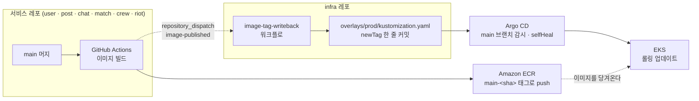
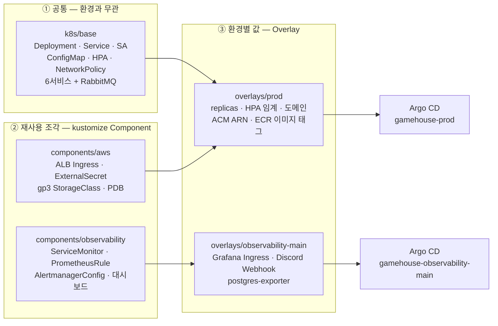

# infra

GameHouse의 **실행 환경**을 담는 레포. 서비스 코드는 여기 없고, 그 코드를 어디에 어떻게 띄울지만 있다.

---

## 1. 좌표

GameHouse는 여러 레포로 나뉘어 있다. 이 레포는 그중 **애플리케이션이 아닌 유일한 레포**다.

| 레포 | 맡은 일 |
|---|---|
| `gamehouse-user` | 계정 · 프로필 · 알림 |
| `gamehouse-post` | 파티 모집글 · 신청 |
| `gamehouse-chat` | 파티 채팅 |
| `gamehouse-match` | Team Fit 매칭 · AI 설명 |
| `gamehouse-crew` | 함께한 기록 · 하우스 추천 |
| `gamehouse-riot` | Riot API 연동 |
| `gamehouse-common` | 6개 서비스가 공유하는 이벤트 계약 |
| `frontend` | React SPA |
| **`infra`** | **매니페스트 · GitOps · 관측 · 부하 테스트** |
| `backend` | 보관 — 레포를 나누기 전의 모노레포 |

서비스 레포는 "이 서비스가 무엇을 하는가"를 설명한다.
이 레포는 "그 서비스들이 **어디서 어떻게 도는가**"만 설명한다.
`Deployment`, `Service`, `Ingress`, `HPA`, `NetworkPolicy`, `ExternalSecret` 은 전부 여기 있다.

환경은 3개다.

| 환경 | 클러스터 | 트래픽 입구 | DB | 시크릿 |
|---|---|---|---|---|
| `local` | kind | ingress-nginx | in-cluster PostgreSQL | 평문 Secret |
| `dev` | EKS | ALB | RDS | External Secrets |
| `prod` | EKS (`gamehouse-main`) | ALB | RDS | External Secrets |

frontend `Deployment` 는 **local 에만 있다.** dev/prod 의 프런트는 S3 + CloudFront 라 클러스터 밖이다.

---

## 2. 배포 흐름도

코드를 고치는 곳과 배포를 일으키는 곳이 다르다. 서비스 레포는 **이미지까지만** 만들고, 클러스터에 반영하는 것은 Argo CD다.



**읽는 법**

1. 서비스 레포의 CI가 이미지를 ECR에 올린다. 태그는 `main-<커밋 SHA 40자리>`.
2. 같은 CI가 infra 레포로 `repository_dispatch` 를 쏜다. 페이로드는 `{ service, sha, env }`.
3. `image-tag-writeback` 워크플로가 해당 서비스의 **`newTag` 한 줄만** 고쳐서 커밋한다.
   커밋 전에 `kustomize build` 로 렌더가 깨지지 않는지 확인하고, 다른 파일이 바뀌었으면 중단한다.
4. Argo CD가 `main` 브랜치의 `k8s/overlays/prod` 를 보고 있다가 그 커밋을 가져간다.
5. `selfHeal: true` — 누가 클러스터를 손으로 바꿔도 Git 상태로 되돌린다.

**배포 승인 지점은 `develop → main` PR 이다.**
Argo CD 수동 sync를 따로 두지 않았다. 브랜치 분리가 이미 승인 역할을 하기 때문이다.
`env` 가 `dev` 면 `develop` 브랜치의 `overlays/dev`, `main` 이면 `main` 브랜치의 `overlays/prod` 로 간다.

**Argo CD 구조는 app-of-apps 다.**

```
사람 ──kubectl apply(최초 1회)──> gamehouse-prod-root
                                    ├─> gamehouse-prod               ──> overlays/prod
                                    └─> gamehouse-observability-main ──> overlays/observability-main
```

사람이 `kubectl apply` 하는 파일은 `k8s/argocd/root/prod.yaml` **하나뿐**이다.
이후 Application 을 추가할 때는 `k8s/argocd/applications/prod/` 에 파일을 넣고 그 `kustomization.yaml` 에 등록하면 된다.

`prune: false` 다. Git에서 파일을 지워도 클러스터 리소스는 남는다(고아). 삭제는 수동이다.

`kube-prometheus-stack` · `Loki` · `Alloy` · `Argo CD 자신` 은 이 흐름 밖에 있다. Helm 으로 직접 설치·업그레이드하고, values 는 `k8s/platform/values/*.main.yaml` 에 있다.

---

## 3. 매니페스트 조립도

환경마다 매니페스트를 복사해 두지 않는다. **한 벌을 세 겹으로 덮어쓴다.**
그래서 `k8s/` 아래 디렉터리는 종류별이 아니라 **겹(layer)별**로 나뉘어 있다.



**층마다 담는 것이 정해져 있다.**

| 층 | 여기 들어간다 | 여기 안 들어간다 |
|---|---|---|
| `base/` | 어느 환경에서도 똑같은 것. 컨테이너 포트, 프로브 경로, 서비스 간 통신 규칙 | 이미지 태그, 클라우드에 종속된 것 |
| `components/aws/` | **EKS 위에서 돌기 위한 구조** — ALB Ingress, External Secrets, PDB, gp3 | 환경별 **값** — ARN, 도메인, replicas, Secrets Manager 경로 |
| `components/observability/` | 관측 **배선** — 무엇을 긁어갈지, 언제 알람을 울릴지 | Prometheus·Loki·Alloy 자체 (그건 Helm) |
| `overlays/<env>/` | 그 환경에서만 다른 **값** | 다른 환경도 쓸 구조 (그건 component로 올린다) |

### user 서비스 하나가 prod에 뜨기까지

```
base/user/                       Deployment(image: gamehouse-user, 태그 없음) · Service
                                 ConfigMap · HPA · NetworkPolicy · 평문 db-secret
        │
        ▼
components/aws                   평문 db-secret 을 $patch: delete 로 제거
                                 → ExternalSecret 이 같은 이름으로 다시 만들고
                                   AWS Secrets Manager 값으로 채운다
                                 + ALB 헬스체크용 Service 패치, PDB
        │
        ▼
overlays/prod                    configmap-user  : 운영 환경값
                                 hpa-user        : 상시 개수 · 확장 임계
                                 networkpolicy-user : RDS(클러스터 밖) egress 허용
                                 images          : ECR 주소 + main-<sha> 태그 확정
                                 replacements    : ExternalSecret 경로의 ENV 세그먼트 치환
        │
        ▼
kustomize build                  네임스페이스 gamehouse 의 최종 Deployment
```

`base` 의 평문 Secret 은 지우지 않고 남겨 둔다. **local 이 그걸 쓰기 때문**이다.
dev/prod 는 `components/aws` 가 그것을 삭제하고 ExternalSecret 으로 갈아 끼운다.
그래서 Argo CD 가 소유하는 것은 `ExternalSecret` 이고, 그것이 만들어낸 `Secret` 은 소유하지 않는다.

### 이 조립에 들어가지 않는 것

| 경로 | 무엇 |
|---|---|
| `eks/main-cluster.yaml` | eksctl 클러스터 정의. 노드 타입 · 개수 · 서브넷 배치 |
| `k8s/platform/values/` | Helm 차트 values — Prometheus · Loki · Alloy · Argo CD |
| `docker-compose*.yml` · `observability/` | EKS 이전의 단일 EC2 구성. 로컬 스택과 부하 테스트용으로 남아 있다 |
| `scripts/` | kind 기동 · 시크릿 주입 · 스케일 등 로컬 보조 스크립트 |
| `load-test/` | k6 시나리오 · 시딩 · N+1 프로브 |

---

## 더 보기

- [`k8s/README.md`](k8s/README.md) — 환경 3종 비교, kind 기동, 반복 개발, 매니페스트 검증, 이미지 주입
- [`load-test/README.md`](load-test/README.md) — k6 회차 실행, Grafana 연동, N+1 프로브, 회차 직후 점검
